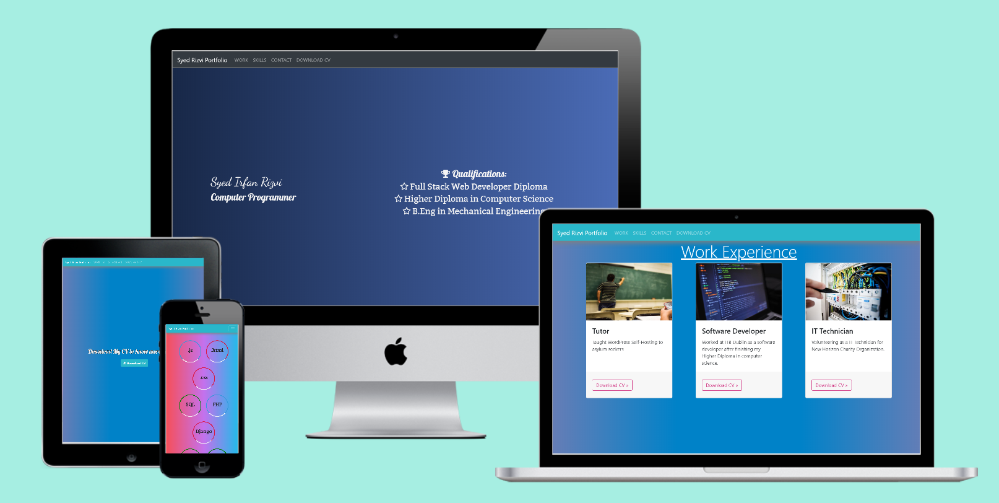
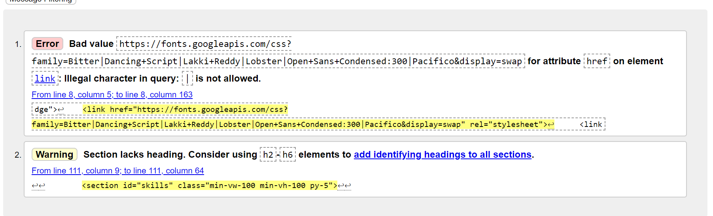

# Syed Irfan Rizvi Portfolio Website
This project is to make a personal portfolio website to show my skills in HTML, CSS and Bootstrap framework. I am a computer programmer with excellent programming _skills in Java, JSP, PHP, Javascript, Jasmin, JQuery, CSS, Bootstrap, HTML, SQL, Python, Shell etc._
The website is live on: [Syed Irfan Rizvi Portfolio Website](https://irfanrizvidev.github.io/portfolio/)

## Sections of the website:
[Home Page (Landing page)](assets/wireframe/home.png)
[Work Page](assets/wireframe/work.png)
[Skills Page](assets/wireframe/skills.png)
[Contact Page](assets/wireframe/contact.png)
[Download CV page and Footer](assets/wireframe/footer-CV.png)
### Qualifications
#### Higher Diploma in Computer Science
I have a __Higher Diplome in Computer Sceince (Level 8)__ from IT Blanchardstown, Dublin which enhanced my understanding of many disciplines in computer science including Databases, Computer languages, Web languages, Computer hardware, Operating systems, Virtual Machines etc. I passed my level 8 with a ___First Class Honours___. 
##### Final Year Project:
I passed my final year proect with 95% scores. I was offerred work placement in my college because of my good grades in all the subjects. My final year project was also part of my internship. I used JSP, Mockito, JUnit, Jenkins, Ubuntu 14.04/16.04, Javascript, JQuery, Hypervisor, PHP, Shell, PostgreSQL etc. I built a framework to host Capture the Flag (CTF) challenges and the challenges as well. 
#### FullStack Web Development Diploma
I am currently pursuing __Fullstack web development diploma__ from Code Institute, Dublin. I have learnt a lot of useful skills from this course including Javascript, HTML, CSS, Python etc. 
##### First Milestone Project:
This portfolio website is one of the Milestones of the course out of 4 Milestone projects. 
#### B.Eng in Mechanical Engineering
I have a degree in ___Mechanical Engineering___ from IT Tallaght, Dublin. I received an award of Excellence on completion of the degree. I passed the degree with a distinction and 3.96 overall GPA. 
##### Final Year project
I scored 82% in the final year project of the Mechanical Engineering Degree.

### Work
This section of the website includes my work history. 

### Skills
This section has some of my skills as a computer programmer. 

### Contact

This section has a form to contact me.

### Download CV
This section allowed the users to download my CV.

### Header and Footer
The header section has NAV bar with all the links to the sections. The footer has the copyright information of the website. 

## Technologies Used:
### Javascript
Javascript is used to change the colour of the navigation when it is scrolled down from its original position. 

### CSS
CSS is used to style the website

### HTML
HTML is used to build the  core of the website

### Github / GIT / GITPOD
Github is used to store the code. GIT is used for version control. GITPOD is used as the IDE. 

## Testing
### Functionality Testing:
#### All links checked
* Nav bar links working for all the sections
* Links of the social icons left blank on purpose
* The main logo works fine for the homepage
* The buttons checked to download the CV in work section

#### HTML Validated
The html is validated using w3school HTML validator and the following result if found:

The image above shows that invalid character is used in the google fonts api link. It is normal to see this error and causes no problems. The second is a warning which is not serious.

The css is validated and there are no errors on w3school css validator. The image below shows the css validation badge in my footer

### Usability Testing
#### Ease of use
* The website is easy to use and distinct sections are created for different tasks. 
* All of them have only relavent information to that section.
* The nav bar has all the links to all the sections.
* The sections are consistent. 
* main menu fixed to be accessible on each section.

#### Content Checking
The content is consistent and relavent to each sections and appropriate styling is used for each section's content.

### Compatibility Testing
* The website is responsive and looks great on wide variety of devices e.g. smartphones, desktop devices, laptops etc
* The website works great on different browers e.g. Firefox, google chrome, IE
    * my-auto class to center divs vertically worked perfectly fine in all the browsers except Internet explorer. It was fixed using a custom class to vertically center divs. 

## Deployment
The website is deployed on Github.io. It is live on the link gven above. 

## Credits
### Content
* The navbar was copied from Bootstrap website from templates.
* The javascript which changes the colour of the navbar was taken from stackoverflow
* The trick to make border around the skills was copied from https://www.w3schools.com/howto/howto_css_loader.asp
* Work section cards were copied from https://www.developerdrive.com/responsive-landing-page-bootstrap-4/

### Media
* The images were taken from Pexels.
* Gradients used on each section were used from https://uigradients.com/
* Multi device mockup was created on https://techsini.com/multi-mockup/index.php

### Acknowledgements
* Munnizzah helped me to select the color scheme for website.
* Emal helped me with testing the website on differnt viewports.